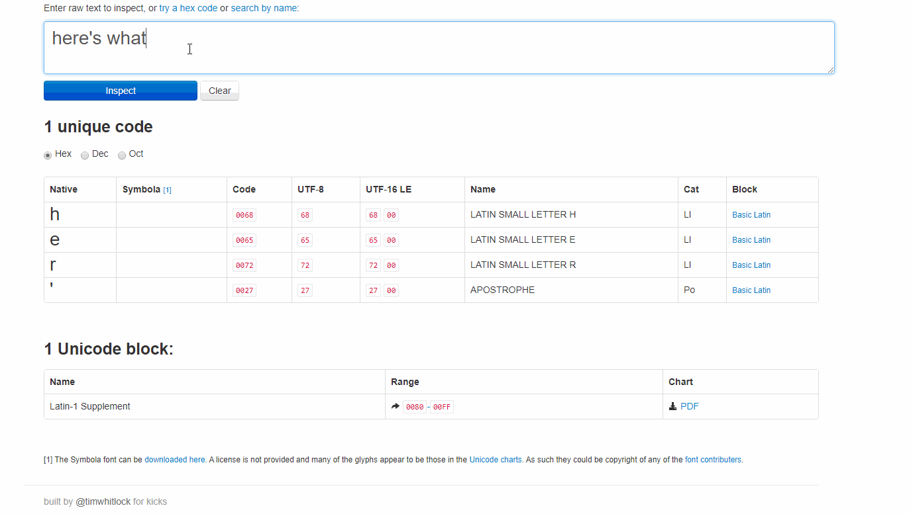

"# LongPressCharacterCycler" 

This script allows to press-and-hold a key in order to cycle between charecter variants of the pressed key.

For example, by pressing-and-holding the "e" key you get the following characters: eéëεèêēē 

Requires [AutoHotkey] to be installed on your system (https://www.autohotkey.com/)
